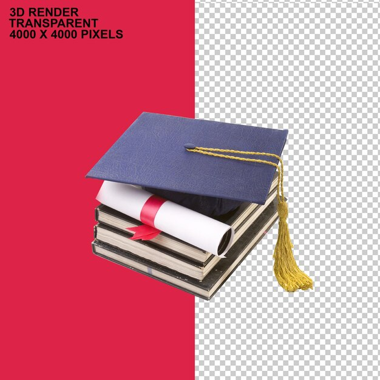

While it may seem unimpressive, I have to say, if I am being honest, that graduating from Kapiolani Community College is one of the top three projects I have completed in my life.  I am so glad I made the switch to being a computer science major in Fall 2022.  I am very curious to see where this takes me.
I think we worked on Java in both ICS 111 and ICS 211.  That was a fun language.  I was not using any ChatGPT at this point; it was not allowed.  This was my first real experience coding, aside from some HTML I did when I was in about sixth grade.
I also really enjoyed the Discrete math classes, and I performed well.  I am disappointed there will be no further Discrete math courses at UH that are necessary for the B.A. in computer science.  Nor is there any more physics or chemistry.  I originally wanted to be a chemistry major, but I am so glad I switched to computer science.

<pre>

</pre>

